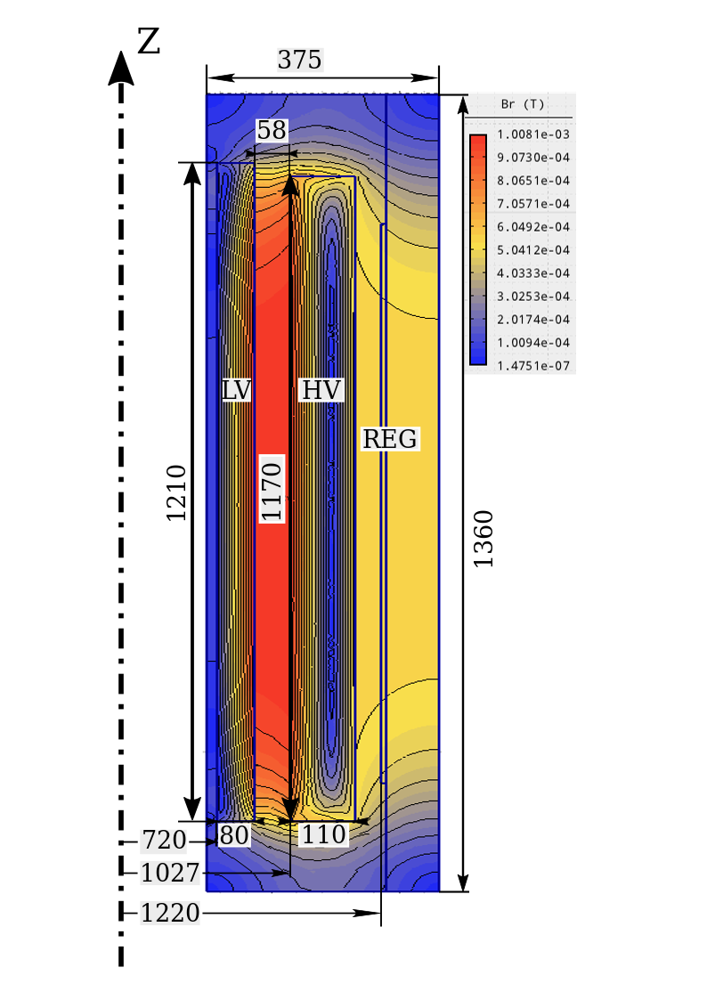

Short Circuit Impedance Calculation
------------------------------------

% The optimization results on the 162page in Kulkarni
The accuracy and the physical correctness of the applied transformer model is demonstrated on an existing, 3 phase, 6.3 MVA, 33/22 kV, star/delta connected transformer. The core has a three-legged layout and made of M6 steel. The core filling factor was 0.85. The details of the manufactured transformer data are presented in \cite{karsai1987large}. 

The independent variables of the reduced transformer model is defined by the following parameters of the manufactured model:

\begin{itemize}
\item{$D_c = 368$ mm is the core diameter,}
\item{$B_c = 1.57$ T is the flux density,}
\item{$h_s = 979$ mm is the height of the low voltage winding,}
\item{$g = 26.7$ mm is the main gap distance is,}
\item{$j_s = 3.02 {A \over mm{^2}}$ is the current density in the LV winding,}
\item{$j_p = 3.0 {A \over mm{^2}}$ is the current density in the HV winding,}
\item{$j_r=1.86 {A \over mm{^2}}$ is the current density in the REG.}
\end{itemize}
Using these values, the optimization model gives back the same turn voltage value ($U_T$ = 31.0 V) and the calculated core mass is $M_c$ = 4786 kg, which is very close to the 4764 kg \cite{karsai1987large}. The high voltage winding is regulated by a linear tap changer \cite{ryan2013high}. The regulating range is 15\% and the regulating winding is placed in the middle of the splitted high voltage winding (Fig. \ref{fig:validation}). The main dimensions of the high voltage and the low voltage windings are depicted in Fig. \ref{fig:validation} and their main parameters --- calculated and measured -- are compared in Table \ref{table:validation}. 

It can be seen from the results that the calculated losses are very close to the reference values. The resulting losses of the optimization are smaller, this can be the result of the applied methodology, which found different conductor heights for the optimum. The difference between the radial width of the windings is not significant, it is lesser than half of the mm. This can happen, because the outline sizes of the windings are calculated by the usage of the winding filling factors, which not differentiates in the radial and in the axial direction. However, the filling factor is smaller in the axial direction, because of the applied cooling duct heights between the discs. 
The calculated short-circuit impedance (SCI) is 7.43\%, which is very close to the detailed model based calculations (7.18\%) \cite{karsai1987large}. 

{: style="height:150px;width:150px"}

> > title={Transformer engineering},
  author={Kulkarni, Shrikrishna V and Khaparde, SA},
  year={2004},
  publisher={Marcel Dekker New York}