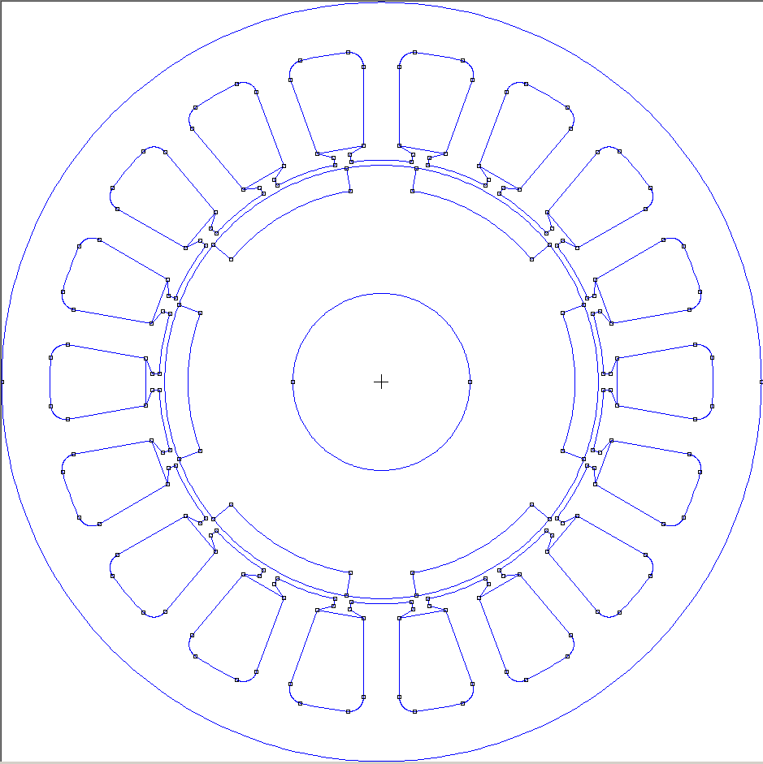
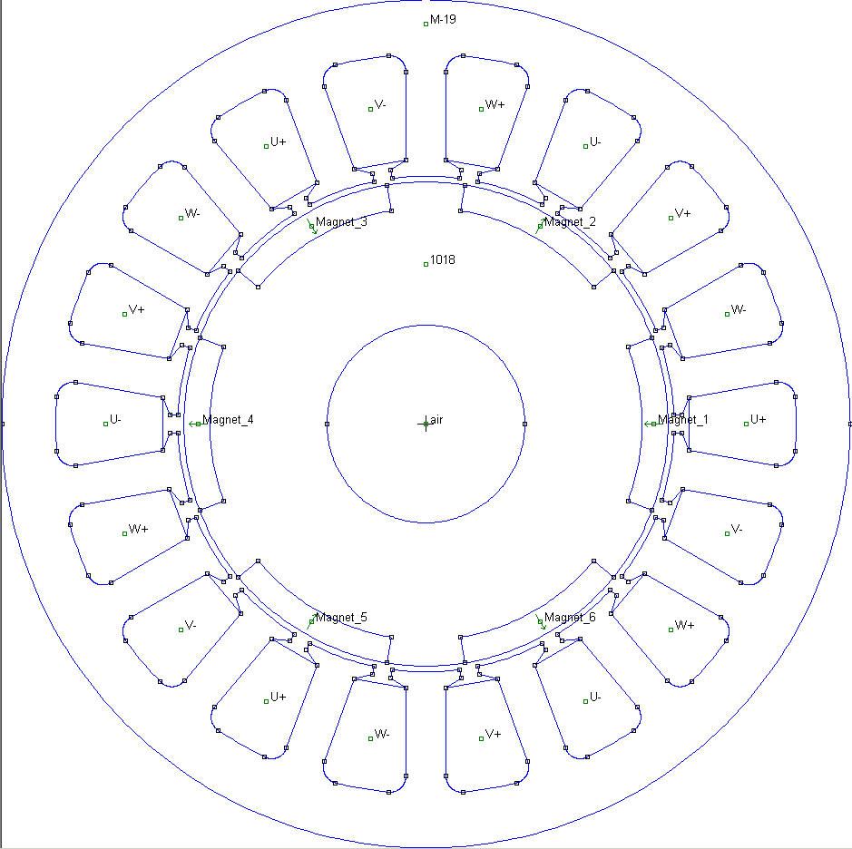
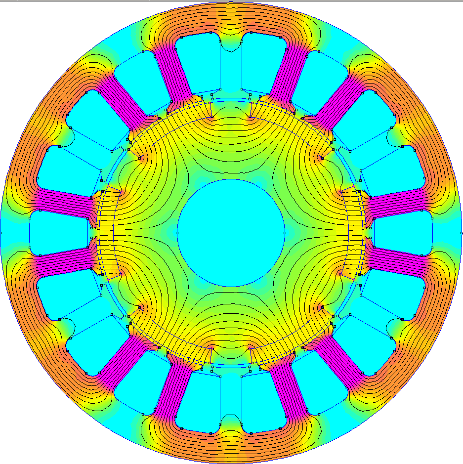
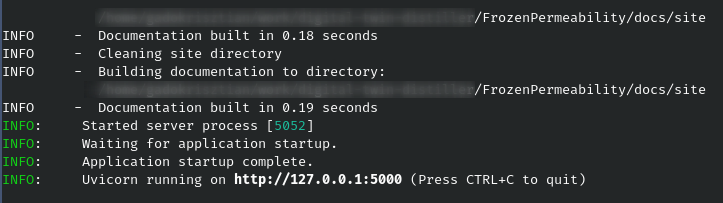
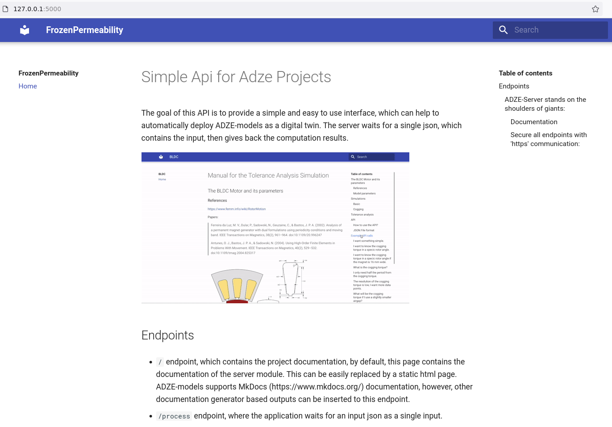
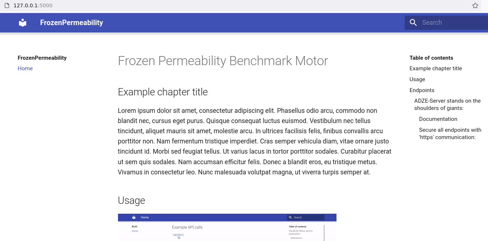

# Digital-twin build guide


In this chapter we introduce and explain every concept of the `digital-twin-distiller`
package by building a containerized motor simulation. The following main ideas/parts will
be covered:

- How to create new models,
- how to build models,
- how to use different fem solvers to compute the model,
- how to build a callable API with the model,
- how to encapsulate with Docker images

The final model can be viewed at `examples/fem_simulations/FrozenPermeability`.

## Creating a model

First we need to create a model. To do this we call the command line interface. It has 2
arguments: the name of the model and the location where the generated files will appear.
During this guide we will rebuild an IPSM found in a FEMM tutorial named Frozen Permeability
Benchmark: <https://www.femm.info/wiki/FrozenBenchmark>.

Let's create a new model in the current directory. The format of the command is this:
``` shell
python -m digital_twin_distiller new NAME LOCATION
```
The name of this model will be `FrozenPermeability`:
``` shell
python -m digital_twin_distiller new FrozenPermeability .
```

!!! tip

    Make sure your python has installed the `digital_twin_distiller` package or it will
    throw a "module not found" error. Or if you installed into a virtual environment, make
    sure to activate it. If the virtual environment is activated then you should have a
    `(.venv)` written in front of your promnt.

After this command we can observe the following generated directory/file structure:
```shell
FrozenPermeability/
├── data/
├── defaults/
│   ├── misc.json
│   ├── model.json
│   └── simulation.json
├── docs/
│   ├── docs/
│   │   ├── images/
│   │   └── index.md
│   ├── mkdocs.yml
│   └── site
├── media/
├── resources/
├── snapshots/
├── model.py
└── simulation.py
```
`data/`: All generated simulation results can be placed here.

`defaults/`: The default model inputs and simulation parameters in json format.

`misc.json`: Miscellaneous parameters can be placed in this file.

`model.json`: The default names and values of the model.

`simulation.json`: Definition of the simulation names, parameter names and their default values.

`docs/`: The documentation of the model should placed here.

`docs/`: Containes the markdown files of the documentation. Can be nested.

`images/`: The figures/plots of the documentation.

`index.md`: The main markdown file of the documentation.

`mkdocs.yml`: The configuration file of the mkdocs package.

`site`: The static html site that is built from the markdown files. This will be served by
the API.

`media/`: Plots/figures that are generated from the `data/` folder.

`resources/`: Any resource that is needed for the model. For example dxf files, bh-curves

in csv format etc.

`snapshots/`: The solver scripts will be generated under this directory. It is advisibleto frequently delete this directory.

`model.py`: The definition of the model.

`simulation.py`: It contains the API and the simulations that for the model.


## Building the model

Building the model is done by implementing a couple of class methods in the `model.py`
file. In this file there is a class declaration with 5 abstract methods that are related
to the classical FEM workflow.

```python
from digital_twin_distiller.boundaries import DirichletBoundaryCondition
from digital_twin_distiller.material import Material
from digital_twin_distiller.metadata import FemmMetadata
from digital_twin_distiller.model import BaseModel
from digital_twin_distiller.modelpaths import ModelDir
from digital_twin_distiller.platforms.femm import Femm
from digital_twin_distiller.snapshot import Snapshot

ModelDir.set_base(__file__)


class FrozenPermeability(BaseModel):
    """this FrozenPermeability created when calling 'new'"""

    def __init__(self, **kwargs):
        super().__init__(**kwargs)
        self._init_directories()

        self.iU = kwargs['iU']
        self.iV = kwargs['iV']
        self.iW = kwargs['iW']
        self.theta = kwargs['theta']

    def setup_solver(self):
        femm_metadata = FemmMetadata()
        femm_metadata.problem_type = "magnetic"
        femm_metadata.coordinate_type = "planar"
        femm_metadata.file_script_name = self.file_solver_script
        femm_metadata.file_metrics_name = self.file_solution
        femm_metadata.unit = "millimeters"
        femm_metadata.smartmesh = True
        femm_metadata.depth = 1000

        self.platform = Femm(femm_metadata)
        self.snapshot = Snapshot(self.platform)

    def define_materials(self):
        air = Material('air')

        self.snapshot.add_material(air)

    def define_boundary_conditions(self):
        a0 = DirichletBoundaryCondition("a0", field_type="magnetic", magnetic_potential=0.0)

        # Adding boundary conditions to the snapshot
        self.snapshot.add_boundary_condition(a0)

    def add_postprocessing(self):
        points = [(0, 0)]
        self.snapshot.add_postprocessing("integration", points, "Energy")

    def build_geometry(self):
        # ...
        self.snapshot.add_geometry(self.geom)


if __name__ == "__main__":
    m = FrozenPermeability(exportname="dev")
    print(m(cleanup=False))
```

### Define inputs

First we have the `__init__` constructor. This is the entry point of the model, any
external input should be defined as an argument to this function. For this model we have 4
inputs: the mechanical angle of the rotor and the phase currents. This can be implemented
as such:

``` python
    def __init__(self, **kwargs):
        super().__init__(**kwargs)
        self._init_directories()


        self.iU = kwargs.get("iU", 0.0)
        self.iV = kwargs.get("iV", 0.0)
        self.iW = kwargs.get("iW", 0.0)
        self.theta = kwargs.get("theta", 0.0)

```
After that, default values have to be defined for the inputs. Open the `default/model.json` file and
place key-value pairs in it:

```json
{
    "theta": 0.0,
    "iU": 0.0,
    "iV": 0.0,
    "iW": 0.0
}
```
This step is necessary because the API will have to know all default values in order to
ensure robust functioning (handling missing values for example).

### Set up the FEM solver

Next, we have the `setup_solver` method. Here we specify the backed solver and its
parameters. As it can be seen it is already filled in for a FEMM solver. This can be
changed to any other implemented solver, it doesn't affect the structure of the model. The
last line of this method is important:
```python
self.snapshot = Snapshot(self.platform)
```
Here we create a `Snapshot` object. This object contains all the information needed to
create and execute a FEM simulation. Geometry, solver settings, material definition etc.
Above this, there is a wrapper class called `BaseModel` which implements a couple of
convenience and managing functions for snapshot objects. User defined models should be
derived from this base. Nevertheless, we still have to interact with the snapshot object
that resides in the models class.
For this modell the FEMM solver will be sufficient, only the depth of the model should be
changef from `1000` mm to `30` mm.
```python
        femm_metadata.depth = 30
```

### Define materials

Up next is the material definitions in `define_materials`. First we have to create various
`Material` objects with different attributes then we have to add them to the snapshot
object. The constructor has 1 mandatory argument which is the name of the material. This
is because later the labels will reference the materials by their name.
``` python
    def define_materials(self):
        # creating material objects
        air = Material("air")
        steel_m19 = Material("M-19")
        steel_1018 = Material("1018")
        magnet = Material("Magnet")
        coil = Material("coil")

        # modifying material properties

        steel_m19.thickness = 0.635
        steel_m19.lamination_type = "inplane"
        steel_m19.fill_factor = 0.98
        steel_m19.conductivity = 1.9e6
        steel_m19.b = [ 0.0, 0.05, 0.10, 0.15, 0.20, 0.25, 0.30, 0.35, 0.40, 0.45, 0.50, 0.55, 0.60, 0.65, 0.70, 0.75,
                0.80, 0.85, 0.90, 0.95, 1.00, 1.05, 1.10, 1.15, 1.20, 1.25, 1.30, 1.35, 1.40, 1.45, 1.50, 1.55, 1.60,
                1.65, 1.70, 1.75, 1.80, 1.85, 1.90, 1.95, 2.00, 2.05, 2.10, 2.15, 2.20, 2.25, 2.30, ]
        steel_m19.h = [ 0.0, 15.120714, 22.718292, 27.842733, 31.871434, 35.365044, 38.600588, 41.736202, 44.873979,
                48.087807, 51.437236, 54.975221, 58.752993, 62.823644, 67.245285, 72.084406, 77.420100, 83.350021,
                89.999612, 97.537353, 106.201406, 116.348464, 128.547329, 143.765431, 163.754169, 191.868158,
                234.833507, 306.509769, 435.255202, 674.911968, 1108.325569, 1813.085468, 2801.217421, 4053.653117,
                5591.106890, 7448.318413, 9708.815670, 12486.931615, 16041.483644, 21249.420624, 31313.495878,
                53589.446877, 88477.484601, 124329.410540, 159968.569300, 197751.604272, 234024.751347, ]

        steel_1018.conductivity = 5.8e6
        steel_1018.b = [0.0, 0.2503, 0.925, 1.250, 1.390, 1.525, 1.71, 1.87, 1.955, 2.02, 2.11, 2.225, 2.43]
        steel_1018.h = [ 0.0, 238.7325, 795.775, 1591.55, 2387.325, 3978.875, 7957.75, 15915.5, 23873.25, 39788.75,
                79577.5, 159155, 318310, ]
        steel_1018.phi_hmax = 20

        magnet.mu_r = 1.04496
        magnet.coercivity = 891000

        coil.diameter = 0.643808017739015
        coil.lamination_type = "magnetwire"
        coil.conductivity = 58e6
```

Add these materials to the snapshot:
```python
        self.snapshot.add_material(air)
        self.snapshot.add_material(steel_m19)
        self.snapshot.add_material(steel_1018)
```
There are 2 missing pieces: the magnets and the excitation. The magnets have matching
attributes except their remanence angle. There are 6 magnets in this motor so we have to
generate 6 magnet material. We can use the already defined `"Magnet"` material, copy it
and modify its properties then add it to the snapshot. This code snippet does this:
``` python
        # magnet angles:

        flipper = cycle([0, 180])
        for i in range(6):
            # copy existing base material
            newMagnet = copy(magnet)

            # modify its properties
            newMagnet.name = f"{newMagnet.name}_{i+1}"
            newMagnet.remanence_angle = fmod(180 + i * 360 / 6 + next(flipper) + self.theta, 360.0)

            # add it to the snapshot
            self.snapshot.add_material(newMagnet)
```
Add these imports to the top of the file:
```python
from itertools import cycle
from math import fmod
from copy import copy
```

We can do the same for the excitation materials, the only difference is that we have to
define the excitation with current density and not current. The conversion is done by
dividing the current with the cross section area of the coil. For this model this is
`0.000114934` m2. We have 3 phases and 2 direction so in total we have to generate 6
materials. This can be done with the following code snipppet:

``` python
        coilArea = 0.000114934  # m2
        N = 152  # number of turns
        currentDensities = [N * self.iU / coilArea, N * self.iV / coilArea, N * self.iW / coilArea]
        phaseNames = ['U', 'V', 'W']
        for i in range(3):
            newPositiveCoilMaterial = copy(coil)
            newPositiveCoilMaterial.name = phaseNames[i] + '+'
            newPositiveCoilMaterial.Je = currentDensities[i]
            self.snapshot.add_material(newPositiveCoilMaterial)


            newNegativeCoilMaterial = copy(coil)
            newNegativeCoilMaterial.name = phaseNames[i] + '-'
            newNegativeCoilMaterial.Je = -currentDensities[i]
            self.snapshot.add_material(newNegativeCoilMaterial)
```
### Define boundary conditions

After this we have to define the boundary conditions. In this case there are only one
which is a homogeneous Dirichlet boundary condition along the most outer circle:
```python
    def define_boundary_conditions(self):
        a0 = DirichletBoundaryCondition("a0", field_type="magnetic", magnetic_potential=0.0)

        self.snapshot.add_boundary_condition(a0)
```
Other types of boundary conditions can be: Neumann, periodic or antiperiodic. Be aware
that not all backend solver can handle periodic/antiperiodic boundary conditions. For
example Agros2D cannot.
Let's assign this boundary condition to the outer circle arcs of the geometry. We can do
this before the geometry is even part of the snapshot object. To do this there is a helper
method called `assign_boundary_arc`. This method has 3 arguments: `x` and `y` coordinates and
the name of the boundary condition. The function will search the circle arc that is the
closest to that xy coordinates and assigns the boundary to it:

``` python hl_lines="6 7"
    def define_boundary_conditions(self):
        a0 = DirichletBoundaryCondition("a0", field_type="magnetic", magnetic_potential=0.0)

        self.snapshot.add_boundary_condition(a0)

        self.assign_boundary_arc(0, 53, "a0")
        self.assign_boundary_arc(0, -53, "a0")
```

### Build the geometry

Next we create the geometry in the `build_geometry` method. In this case we have 2 dxf
files for the rotor and the stator. Place them under the `resources` directory the load
them into a `ModelPiece` object:

``` python
    def build_geometry(self):
        stator = ModelPiece("stator")
        stator.load_piece_from_dxf(ModelDir.RESOURCES / "stator.dxf")

        rotor = ModelPiece("rotor")
        rotor.load_piece_from_dxf(ModelDir.RESOURCES / "rotor.dxf")
```

`ModelPiece` objects can be used to build the final geometry from smaller parts. You can
load `svg` or `dxf` files into them and you can transform the geometries in various ways:
translation, rotation, scaling. For this motor, we have to rotate the rotor piece
according to the input variable `theta`:

``` python hl_lines="7"
    def build_geometry(self):
        stator = ModelPiece("stator")
        stator.load_piece_from_dxf(ModelDir.RESOURCES / "stator.dxf")

        rotor = ModelPiece("rotor")
        rotor.load_piece_from_dxf(ModelDir.RESOURCES / "rotor.dxf")
        rotor.rotate(alpha=self.theta)
```
Each `ModelPiece` has a `geom` attribute that is `Geometry` object. We can add these
objects to the snapshot:

```python hl_lines="9 10"

    def build_geometry(self):
        stator = ModelPiece("stator")
        stator.load_piece_from_dxf(ModelDir.RESOURCES / "stator.dxf")

        rotor = ModelPiece("rotor")
        rotor.load_piece_from_dxf(ModelDir.RESOURCES / "rotor.dxf")
        rotor.rotate(alpha=self.theta)

        self.snapshot.add_geometry(stator.geom)
        self.snapshot.add_geometry(rotor.geom)
```

Now we have an empty geometry:


### Add labels

Labels have to be added to this geometry to indicate that which surface belongs to a
certain material. We can do this in any method not just in `build_geometry`. To add a new
label use the `assign_material` method which has the following syntax:
```python
self.assign_material(label_position_x, label_position_y, label_name)
```
The first 2 arguments are the xy coordinates of the label and 3. is the material
name.

With the help of the `assign_material` add labels to the model. In this example the labels
come after the geometry:
```python
        self.snapshot.add_geometry(stator.geom)
        self.snapshot.add_geometry(rotor.geom)

        # Labels

        self.assign_material(0, 0, "air")
        self.assign_material(0, 30.5, "air")
        self.assign_material(0, 50, "M-19")
        self.assign_material(0, 20, "1018")
```

As before we generate the labels for the magnets and the coils. It is a simple polar
vector rotation and conversion to Cartesian coordinate system.
``` python
        numberOfSlots = 18
        windingLabels = cycle(("U+", "W-", "V+", "U-", "W+", "V-"))
        vectorLength = 40
        for i in range(numberOfSlots):
            angle = radians(i * 360 / numberOfSlots)
            labelX = vectorLength * cos(angle)
            labelY = vectorLength * sin(angle)
            self.assign_material(labelX, labelY, next(windingLabels))
```

Similarly for magnets:
``` python
        numberOfMagnets = 6
        vectorLength = 28.5
        for i in range(numberOfMagnets):
            angle = radians(i * 360 / numberOfMagnets)
            labelX = vectorLength * cos(angle)
            labelY = vectorLength * sin(angle)
            self.assign_material(labelX, labelY, f"Magnet_{i+1}")

```

!!! note

    This is not necessarily the best implementation because of the code duplications,
    however it is a better approach for this guide because it is easier to read.

Now we have a geometry with labels:



### Run the model

Now we have a fully functional model. To run this model simply execute the script file.
The execution can be customized by specifying the name of the directory where the files
will appear with the `exportname` constructor argument. In this case this is `"dev"`:
```python
    m = FrozenPermeability(exportname="dev")
```
`m` now is the model, but we have to call it like a function to actually execute the
computation. This function call has 3 optional arguments: `devmode`, `cleanup`, `timeout`.
If `devmode` is `True` then the solver will open but doesn't try to solve the problem.
This way the model can be debugged, geometry measures can be carried out or you can check
if everything is created as expected. The second argument `cleanup` means that if it is
`True` then the generated directory will be deleted after model execution. The last
argument is `timeout` it specifies the number of seconds after the execution should stop.
It has been added to prevent computation hanging. The error handling can be suited for
different applicaitons.

Here is the result of the execution without any excitation at `0 °` rotor position:



If we print the return value of this call we get nothing:
```python
    print(m(devmode=False, cleanup=True)) # >>> Nothing
```
To get back any meaningful results we have to define the post-postprocessing steps.

### Define Post-Processing

Adding post-processing to a model is done by implementing the `add_postprocessing` method.
It has 3 arguments. The first is an action, this can be `point_value`, `integration` or
`mesh_info`. Next we have to feed a list of coordinates which will be the selectors.
Lastly we specify the variable that we are interested in. This can be `Torque`, `Flux`,
`Energy` etc. For this example we only interested in the torque that the motor produces.
For this we need to integrate the stress tensor on the rotor. To do this we simply filter
out the labels that are on the rotor and drop their material name.
```python
    def add_postprocessing(self):
        # filter the labels that lie inside a 30.5 mm radius circle.
        # rotorLabels = [(x0, y0, "material0"), (x1, y1, "material1"), ... , (xn, yn, "materialn")]
        rotorLabels = filter(lambda pi: hypot(pi[0], pi[1]) < 30.5, self.label_queue)

        # drop the last element, the label name
        # labelCoordinates = [(x0, y0), (x1, y1), ... , (xn, yn)]
        labelCoordinates = map(itemgetter(0,1), rotorLabels)

        # add torque calculation
        self.snapshot.add_postprocessing("integration", labelCoordinates, "Torque")

```
If we run the model now we get back the calculated torque value in a dictionary:
```python
defaultdict(<class 'list'>, {'Torque': 9.824012008555909e-05})
```
That concludes the model creation. Using this model as a unit of calculation we can define
more complex simulations and scenarios in the API.


## Creating callable simulations with a server

First run the `simulation.py` file to see the default implementation of a callable API server. The terminal should look
like this:


First the `mkdocs` package builds a static website from the markdown files then the webserver starts at localhost port
5000. After navigating to this url we should see this:


After this navigate to <http://127.0.0.1:5000/apidocs> to see the interactive API interface.

!!! note

    Windows userts may have to navigate to `/docs` instead of `/apidocs`.

This is an automatically generated page where we can interact with various api endpoints.
For now click on the `ping` endpoint, then `Try it out` then `Execute`. If everything is
working the API should respond with an affarmative answer. Now shut down the server with
`Ctrl+C` and begin to create a simple simulation where we give an input and we get back
the torque.

Adding new types of simulations is done by creating simple functions with a particular
input and using a decorator on them to register in the API. After that the
`simulation.json` needs to be updated too.

First define a function with 3 positional arguments. Its name doesn't matter.

```python
def example_simulation(model, modelparams, simparams, miscparams):
    pass
```

The only restriction is that this function has to have 4 positional arguments as follows:
`model`:  This is will be the `FrozenPermeability` class to build model objects.
`modelparams`:  The default model input parameters that are defined in the
`defaults/model.json` and updated according to the API call.
`simparams`:  Same as with `modelparams` just for simulations.
`miscparams`:  Miscellaneous parameters that don't fit the above categories.

Next we add the decorator in front of the function. It has one parameter: the name of the
simulation. In this case we call it `simple`.

```python hl_lines="1"
@sim.register('simple')
def example_simulation(model, modelparams, simparams, miscparams):
    ...
```

This simulation has 4 inputs: the phase currents and the rotor angle. Update the
`defaults/simulation.json` file accordingly. Here  the parameters and their default values
go under tha name of the simulation:

```json
{
  "default": {},
  "simple": {
      "iU": 0.0,
      "iV": 0.0,
      "iW": 0.0,
      "theta": 0.0

  }
}
```

Next, in the function we create a new model object with the requested parameters:
```python hl_lines="3"
@sim.register('simple')
def example_simulation(model, modelparams, simparams, miscparams):
    motor = model(**simparams)
```
Then execute it with the generated `execute_model` function. This is there for later
parallelization. Finally we give back the execution results without any additional
postprocessing.

```python hl_lines="4-5"
@sim.register('simple')
def example_simulation(model, modelparams, simparams, miscparams):
    motor = model(**simparams)
    result = execute_model(motor)
    return result
```

Now run the `simulation.py` file again and navigate to the `http://127.0.0.1:5000/apidocs`
page. Then open the `process_sim` tab, then `Try it out`. In the request body there is a
json document that can be edited. Change the simulation type from `default` to `simple`
then click execute. If everything is working correctly FEMM should start to compute and
the server should respond like this after a while:
```json
{
  "res": {
    "Torque": 0.00009824012008555909
  }
}
```

### Update the model documentation

We now have a functional API that can compute the torque of this motor but there is no
documentation for the model. To change this, open `docs/docs/index.md` file and edit it:

``` markdown
# Frozen Permeability Benchmark Motor

## Example chapter title

Lorem ipsum dolor sit amet, consectetur adipisci ...
```

Running the `simulation.py` file again we should see the updated documentation at the
index of <http://127.0.0.1:5000>:



### Changing backend solver


## Model encapulation

No we have a model with documentation that can be called to execute simulations. The last
step is to pack this modell and all its dependencies into a container that can run
everywhere and immune to outside chages. To do this we need to create a Docker image.

First, create a `Dockerfle` file under `FrozenPermeability` directory. For this image we
will you Agros2D as a backend solver because it is easier to install:
```
FROM python:3.9.13

# set up working directory
WORKDIR /usr/src/app

# install the digital-twin-distiller package
RUN pip install digital-twin-distiller

# copy model files into the working directory
COPY . .

# start the server
CMD [ "python", "./simulation.py" ]
```

This `Dockerfle` doesn't contain the backend solver installation. It is a template that
can be used in any model. The installation is carried out by adding a layer to this
`Dockerfile`. Before we build the image we have to change the IP address that the server
is binding to from localhost to `0.0.0.0`:

```python hl_lines="9"
if __name__ == "__main__":

    ModelDir.set_base(__file__)

    # set the model for the simulation
    sim.set_model(FrozenPermeability)

    model = Encapsulator(sim)
    model.set_host("0.0.0.0")
    model.build_docs(ModelDir.DOCS)
    model.run()
```

Now build this image:
```
docker build -t frozenpermeability:1.0.0 .
```

Next, run this image:
```
docker run -d -it -p 5000:5000 frozenpermeability:1.0.0
```

Now we get the same behaviour as before but with a docker container that can be
distributed and run everywhere where docker is installed.
