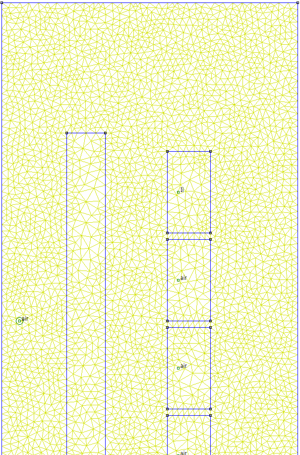
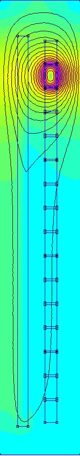
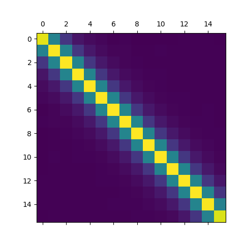
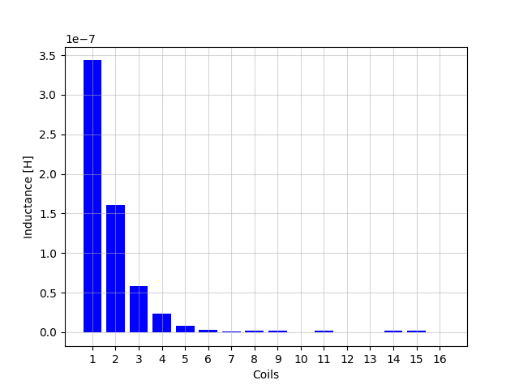
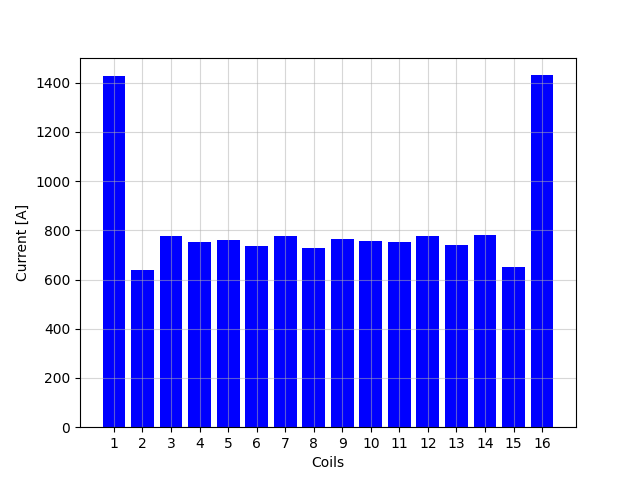

Basic parameters

> V. Nabaei, S. A. Mousavi, K. Miralikhani and H. Mohseni, "Balancing Current Distribution in Parallel Windings of Furnace Transformers Using the Genetic Algorithm," in IEEE Transactions on Magnetics, vol. 46, no. 2, pp. 626-629, Feb. 2010, doi: 10.1109/TMAG.2009.2031980.

The mesh used for the computation:

Results when only 1 coil was excited:

Results when coil 1 and coil 4 were excited:

Results when coil 1 and the high voltage coil were excited:

inductance matrix:

