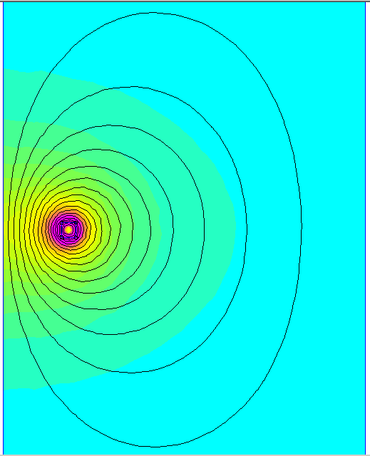
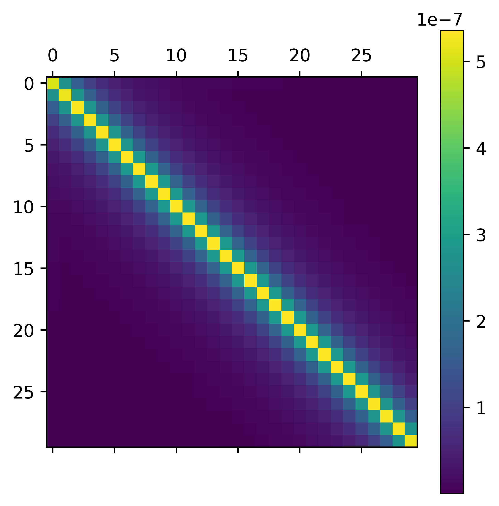

> P. Gomez and F. de León, "Accurate and Efficient Computation of the Inductance Matrix of Transformer Windings for the Simulation of Very Fast Transients," in IEEE Transactions on Power Delivery, vol. 26, no. 3, pp. 1423-1431, July 2011, doi: 10.1109/TPWRD.2011.2104370.

Example mesh:

Example computation with 1 coil:

Example calculation with 2 coils:

The calculated inductance matrix:

The self and mutual inductances between coils:

The meshsize has significant impact on the inductance calculation:
