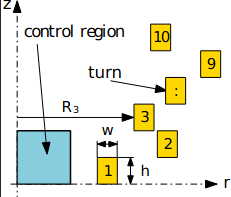

# Problem description

In this example we compute the uniformity of the magnetic field produced by a distributed winding.

*Fig 1: 2D model from the coil geometry and the design variables*

This deals with a seemingly simple problem, where the radius of a given number of circular turns should be optimized
that would generate a uniform magnetic field in the prescribed region. The task is to get a region *(control region in Fig. 1)* with a highly uniform magnetic field distribution. This magnetic
field is generated by a prescribed number (N = 10) of massive circular turns of rectangular cross-section *(yellow color
in Fig. 1)*.

The dimensions of the turns and the variation of their positions in the z-direction are fixed. The coil has 10 turns, each with 1 mm x 1.5mm dimension and 3A excitation. The region [0 mm, 5 mm] x [-5 mm , 5 mm] is
called the control region, and we measure the radial and tangential components of the magnetic flux density within this
area.

Each turn in the winding has a particular distance from the z axis. This is the inner radius of the turns (radii) which
can be varied from 5 mm to 50 mm in the r-direction. These distances are the [input of the model](#x-input variable), so ten unknown radii (design variables)
are to be identified.

**Parameters summary:**

* Control region: [0 mm, 5 mm] x [-5 mm , 5 mm]
* Number of turns: 10
* Turn params
    * Dimension: 1mm x 1.5mm (*w* = 1mm, *h* = 1.5mm)
    * Excitation: 3A
* Radii (*turns distance from z axis*) R1,..., Ri,...,R10 of the ten turns: variation range is 5≤Ri≤50 mm

After the computation we plot the results in a 2D contour plot.

> Backup
>
> The height and the width parameters of the modeled conductors are 1.5 mm and 1.0 mm during the calculations. The inner
radius of the turns  (radii)  can be varied from 5 mm to 50 mm in the r-direction.
