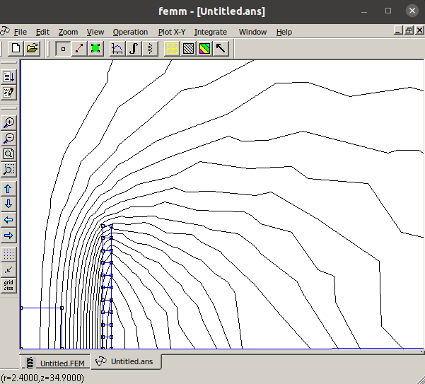

# 2. Usage

You can interact with the API and the digital twin behind it via simple make calls through code or via the `/apidocs`
endpoint.

## 2.1 Api calls by `/apidocs` endpoint

Calling the `/process_sim` endpoints, the interaction happens in a JSON file that is passed along with the call.

> TODO
> In the *fem-simulations* example we examine the Team35 benchmark problem where you can try simulations.
> There are more simulation types, but we use the **Basic** one to presenting the problem.

### 2.1.1 Input JSON File format

The input JSON file has several sections, these are the **simulation, model, tolerances, misc**. The only necessary
section is the simulation, precisely the `type` field in the simulation section. All the other sections are optional.

```json
{
  "simulation": {
    "type": "default"
  },
  "model": {},
  "tolerances": {
    "type": "ff",
    "parameters": {},
    "variables": []
  },
  "misc": {
    "processes": 4,
    "cleanup": true
  }
}
```

#### 2.1.1.1 Simulation section

You can specify the selected simulation as well as its additional parameters if it has any. The simulations and them
default values are defined in the `Team35/defaults/simulation.json` file.

``` json title="simulation.json"
{
  "default": {
      "B0": 2e-3,
      "x": [6, 7, 8, 9, 10, 11, 12, 13, 14, 15]
  }
}
```

#### 2.1.1.2 Model section

You can overwrite the provided model parameters. The default model values can be found into
the `Team35/defaults/model.json` file.

``` json title="model.json"
{
  "x0": 1.0,
  "mw": 5
}
```

> TODO: what is $x_0$ and 'mw'

#### 2.1.1.3 Tolerance section

On this section you can make a tolerance analysis.
> TODO

#### 2.1.1.4 Misc section

In this section other variables are listed that are not tightly coupled with the digital twin. For example if a
simulation is running in parallel you can specify the number of processes here. The default mics values can be found
into the `Team35\defaults\mics.json` file.

```json title="mics.json"
{
  "processes": 4,
  "cleanup": true
}
```

### 2.1.2 Use Default simulation

Run a calculation with the given model parameters. This simulation will give back
the [f1 function](index.md#12-the-f_1-function). If no input is given the simulation will use the default values.

The simulations and them default values defined in the `simulation.json` file.

Parameters of the simulation:

| Parameter            | Value                               |
|:---------------------|:------------------------------------|
| type                 | simulation type                     |
| [B0](index.md#b0)    | magnetic flux density in the pole   |
| [x](index.md#radii)  | vector, consist of 10 radii params  |

#### 2.1.2.1 Api call with specifying parameters

This example has already demonstrated in the [Home page](index.md#13-basic-usage-example-over-api-call)!

#### 2.1.2.2 Api call with pre-defined params, without specifying any other parameters

Example input

```json
{
  "simulation": {
    "type": "basic"
  }
}
```

Example output

```json
{
  "res": {
    "f1": 0.0007730223408010202
  }
}
```

## 2.2 Make calls through code

For calling a simulation to calculate $F_1$ with the given (default) values from code, you have to run :
octicons-triangle-right-24: the `#!python __main__` method in the `model.py` file.

To simulate the problem let's create an input first:

```python
X = [10] * 10
```

In this case, all turns have a distance of 10 mm from the $z$ axis.

```python
m = DistributedWinding(X, exportname="dev")
```

By calling the model object we execute the calculation, then we save the results in a variable. If we don't need the
solver scripts and other files, we can set the cleanup flag to True, otherwise set to False. Also, print the results.

```python
print(m(cleanup=False))
```

### 2.2.1 Set up FEM solver

You can set up a FEM solver. Since there will be no exotic boundary conditions you can use either Agros2D or FEMM. In
this example we provide a setup for both of the software, and you can choose between them by giving the suitable value
to the `platform` variable in the {==highlighted==} line: `platform_femm`, `platform_agros`.

You can find more information about the [setup_solver()](#link-to-long-code-example) on the *Model creation* page.

```python hl_lines="13"
class DistributedWinding(BaseModel):
    ...
    def setup_solver(self):
        ...
        # initialize the femm platform
        platform_femm = Femm(femm_metadata)
        ...
        # initialize the agros2d platform
        platform_agros = Agros2D(agros_metadata)
        ...

        # select a platform to solve the problem
        platform = platform_femm

        # initialize the snapshot object with the chosen platform
        self.snapshot = Snapshot(platform)
    ...
```

### 2.2.2 Run mode

```python
if __name__ == "__main__":
    X = [10] * 10
    m = DistributedWinding(X, exportname="dev")
    print(m(cleanup=False))
```

**You can see the result in the standard output.**

### 2.2.3 Developer mode

Add the `#!python devmode=True` command to the {==highlighted==} line where the calculation called, as the following
code snippet shows:

```python hl_lines="4"
if __name__ == "__main__":
    X = [10] * 10
    m = DistributedWinding(X, exportname="dev")
    print(m(cleanup=False, devmode=True))
```

#### 2.2.3.1 Example in developer mode

During the example we use the **Femm** platform!

> TODO: something about FEMM?

1. After the :octicons-triangle-right-24: run you are going to see the model opened into FEMM platform

!!! Note ""
    Make some modification to see the whole model (zoom and scroll in Zoom tab)


The platform shows the control region and the position of turns. As you can see, all turns have the same, 10 mm distance
from the $z$ axis.

2. Save the file

!!! Info "femm icons"
    

3. Mesh the nodes *(first icon)*


4. Run analysis *(second icon)*

5. View results *(third icon)*



6. 'Color' result *(optional)*

> TODO: check parameters and create 'color' result
