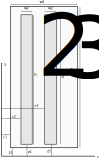

# Short circuit impedance calculation for large Power Transformers

## Physical Model

The model contains a 2D axisymmetric, parametric FEM model in FEMM or in Agros2D to determine the magnetic field in the
working window during its short circuit condition. The magnetic field in the working window of a transformer that is
generally nonlinear may be (with an acceptable error) described by the phasor $\vec A$ of magnetic vector potential
$\vec{A}$ and the corresponding equation reads $$ \nabla^2 \vec{A}=\mu\vec{J}, $$

where $\mu$ denotes the magnetic permeability. Symbol $\vec{J}$ denotes the density of field currents in the windings.
The boundary condition along a sufficiently distant boundary is Dirichlet type. The magnetic permeability in every cell
of the discretization mesh is assumed constant and corresponds to the corresponding magnetic flux density. By the
solution of this problem, the value of the short-circuit reactance can be calculated from the total magnetic energy,
evaluated at the peak current [1-4]:

$$ x_{\rm pu} = \frac{\pi^2 f}{I_{VA}} \int_V{J A {\rm d}V} $$

where $I_{VA} = \sum I_{VA+}$ represents the sum of the amperturns in the defined winding segments. The ratings are the
same for both windings and the plus sign indicates the positive sign current. The other result of the calculation is the
maximum values of the $B_{ax}$ and $B_{z}$ values in the windings.

## Input parameters

The following 7 independent parameters can be varied from the input model of the transformer:

- $D_c$ is the core diameter,
- $B_c$ is the flux density,
- $h_s$  is the height of the low voltage winding,
- $g$  is the main gap distance between the inner and the outer winding of the modeled two-winding transformer,
- $j_s$ Amm^2 is the current density in the LV winding,
- $j_p$ Amm^2 is the current density in the HV winding,
- $j_r$ Amm^2 is the current density in the REG.

## Endpoints

* `/` endpoint, which contains the project documentation, by default, this page contains the documentation of the server
  module. This can be easily replaced by a static html page. ADZE-models supports MkDocs (https://www.mkdocs.org/)
  documentation, however, other documentation generator based outputs can be inserted to this endpoint.

* `/process` endpoint, where the application waits for an input json as a single input.

* `/apidocs` endpoint, which describes the roles and the basic functions of the integrated api endpoint as an OpenAPI
  documentation. Moreover, this html site contains a small, integrated **test interface**.

* `/ping` endpoint, to test the functionality and the accessibility of the realized server from the client side.

## Model Validation

The accuracy and the physical correctness of the applied transformer model is demonstrated on a 3 phase, 6.3 MVA,
33/22 kV, star/delta connected transformer. The core has a three-legged layout and made of M6 steel.
The core filling factor was 0.85. The details of the manufactured transformer data are presented in [4]
The independent variables of the reduced transformer model is defined by the following parameters of the manufactured model:

The input parameters of the transformer model:

- D_c= 368 mm is the core diameter,
- Bc= 1.57 T is the flux density,
- hs= 979 mm is the height of the low voltage winding,
- g= 26.7 mm is the main gap distance is,
- js= 3.02 Amm2 is the current density in the LV winding,
- jp= 3.0 Amm2 is the current density in the HV winding,
- jr= 1.86Amm2 is the current density in the REG.

The measured value of the short-circuit impedance:

The following table contains the detailed geometry of the test transformer:

| Name | Value | Unit  | Description                              |
|------|-------|-------|------------------------------------------|
| w1   | 152   | mm    | width of the window                      |
| h1   | 1129  | mm    | height of the window                     |
| r1   | 184   | mm    | inner radius of the window               |
| z1   | 0     | mm    | height of the window                     |
| w2   | 42    | mm    | width of the low voltage coil            |
| h2   | 979   | mm    | height of the low voltage coil           |
| r2   | 198   | mm    | inner radius of the low voltage coil     |
| z2   | 70    | mm    | height of the low voltage coil           |
| w3   | 41    | mm    | width of the high voltage coil           |
| h3   | 979   | mm    | height of the high voltage coil          |
| r3   | 268   | mm    | inner radius of the high voltage coil    |
| z3   | 70    | mm    | height of the high voltage coil          |
| js   | 3.00  | A/mm2 | current density in the low voltage coil  |
| jp   | -3.02 | A/mm2 | current density in the high voltage coil |

### References
[1] Orosz, T.; Pánek, D.; Karban, P. FEM Based Preliminary Design Optimization in Case of Large Power Transformers. Appl. Sci. 2020, 10, 1361.
 https://doi.org/10.3390/app10041361

[2] Andersen, O. (1973). Transformer Leakage Flux Program Based on the Finite
 Element Method. IEEE Transactions on Power Apparatus and Systems, PAS-92(2),
 682–689. doi:10.1109/tpas.1973.293773

[3] Orosz, T., Karban, P., Pánek, D., & Doležel, I. (2020). FEM-based transformer
 design optimization technique with evolutionary algorithms and geometric
 programming. International Journal of Applied Electromagnetics and Mechanics,
 1–9. doi:10.3233/jae-209504

[4] Karsai, K.; Kerényi, D.; Kiss, L. Large Power Transformers; Elsevier Science Pub. Co. Inc.: New York, NY, USA, 1987.

.: <https://github.com/tamasorosz/utopya/blob/main/src/optimization_functions_003.py>
