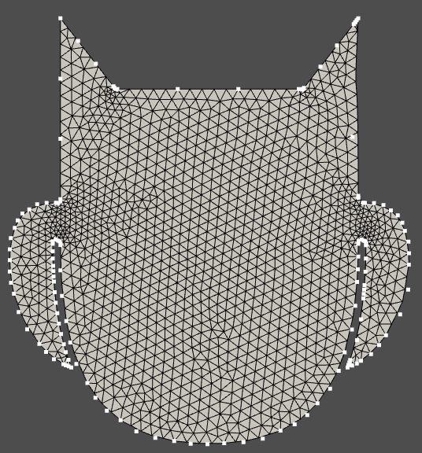

## Meshing an Arbitrary Surface with the Adze-modeler


### Handling Arbitrary SVGs

This small example aims to demonstrate how we can create a mesh from an arbitrary, bezier-curve defined artistic image.  The original image was downloaded from svgrepo.com and simplified; the eyes, nose and other small inner surfaces were removed from the original picture.

The applied algorithm cannot recognize every surfaces in an arbitrary geometry. Every surface for every material should defined separately.




### Importing the geometry

The geometry import from a raw svg can be resolved automatically by a single command
```
eml = files("examples.gmsh-arbitrary-surface.resources").joinpath("owl-shape.svg")
geo = Geometry()
geo.import_svg(eml.as_posix())
```

The duplicated edges and nodes can be filtered out/merged after setting the required tolerance
```
geo.epsilon = 1e-6
geo.merge_points()
```

### Automatic surface detection

The physical surfaces should be defined for a finite element mesh generation.
Adze uses an automatic NetworkX based closed loop detection in the graph of the defined edges.

```
surfaces = geo.find_surfaces()
```

The connection graph of the defined surface can be vizualized by the following command:

```
geo.plot_connection_graph()
```

The model can be automatically exported into a gmsh mesh or plenty of other meshes.

```
gmsh = GMSHModel(geo)
gmsh.lcar = 10.0  # the characteristic length of the applied mesh can be set manually in the gmsh class
gmsh.gmsh_writer('owl_shape')
```

The generated mesh can be plotted out by the following commands:

```
msh = pv.read('owl_shape.msh')
msh.plot(show_edges=True, cpos="xy")
```
